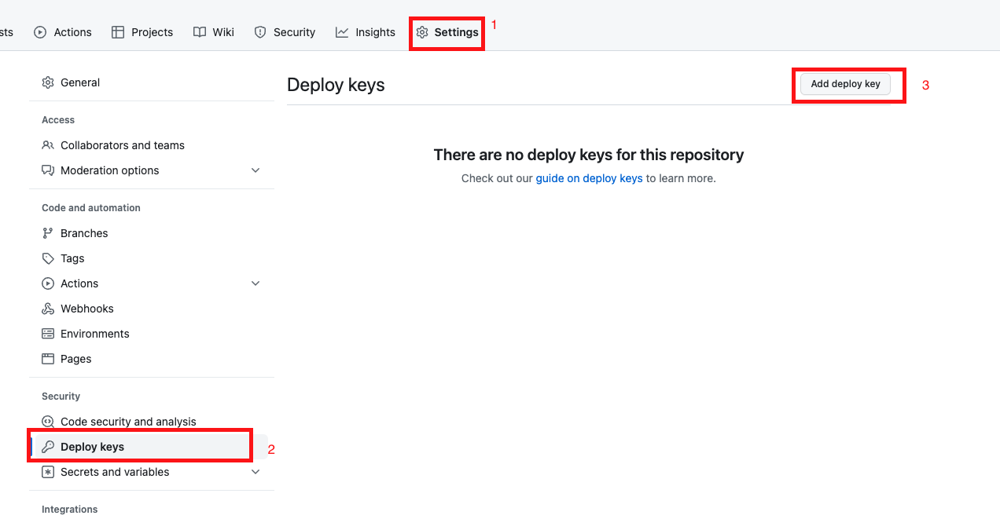
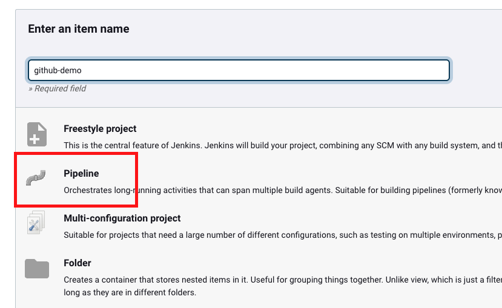
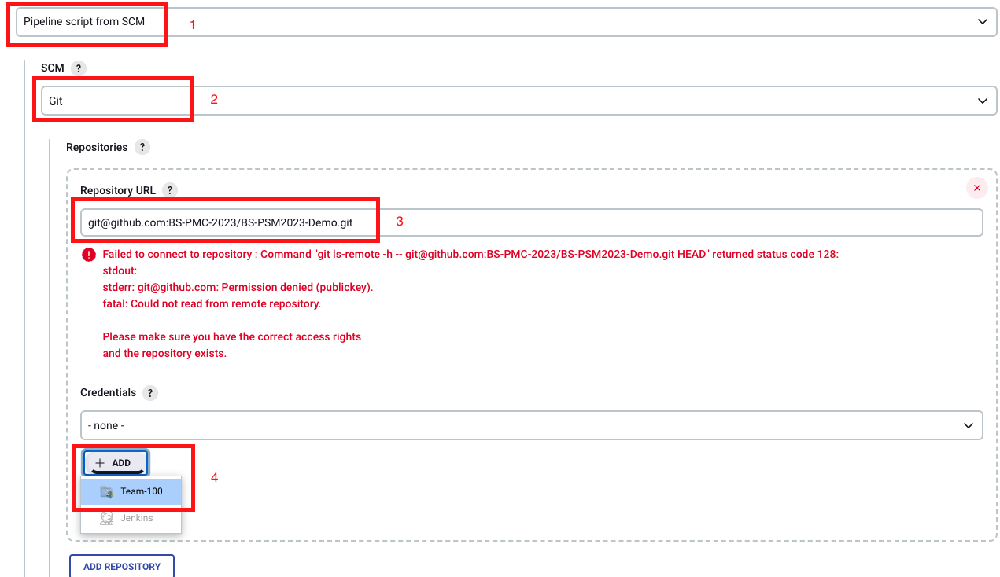
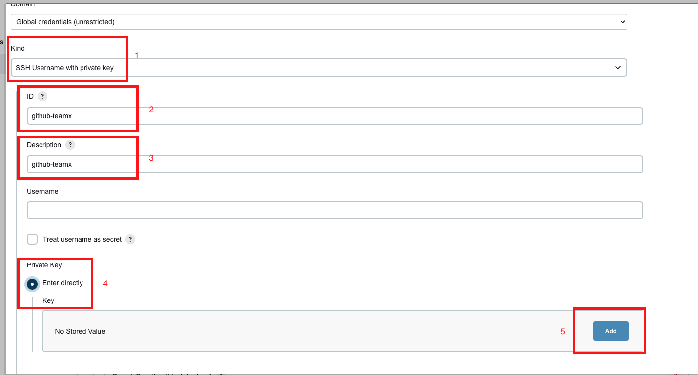

# How connect jenkins and private github repository

1. Generate SSH keys

    Open your terminal and execute the following command to generate the SSH keys:

    ```sh
    ssh-keygen -t rsa -b 4096 -C "your_email@example.com" -f jenkins_ssh
    ```

    Press Enter for all questions, including for the passphrase.

    This will create two files: jenkins_ssh (private key) and jenkins_ssh.pub (public key).

2. Add the public key to GitHub

    Navigate to your GitHub repository, go to Settings, then Deploy Keys.

    Click on Add deploy key and update the Title and Key fields with the content of the jenkins_ssh.pub file.

    

3. Create a simple "Hello World" Jenkinsfile in your Git repo

4. Create a pipeline job in Jenkins

    Click on the New Item button on the Jenkins dashboard, give your pipeline job a name, and select Pipeline. Click OK.

    

5. Configure the Git URL

    In the pipeline configuration, go to the Pipeline section and select Pipeline script from SCM.

    Choose Git as the SCM, and enter the SSH URL of your private GitHub repository.

    

6. Add the private SSH key to Jenkins credentials

    Select SSH Username with private key as the Kind, enter jenkins_ssh as the Username, and paste the content of the jenkins_ssh file into the Private Key field.

    

7. In the pipeline configuration, under the Pipeline script from SCM section, select the SSH key credential you just added in the Credentials dropdown.

8. Save the pipeline job

9. Run the pipeline job

10. Congratulations, you have successfully connected Jenkins to your private GitHub repository!


